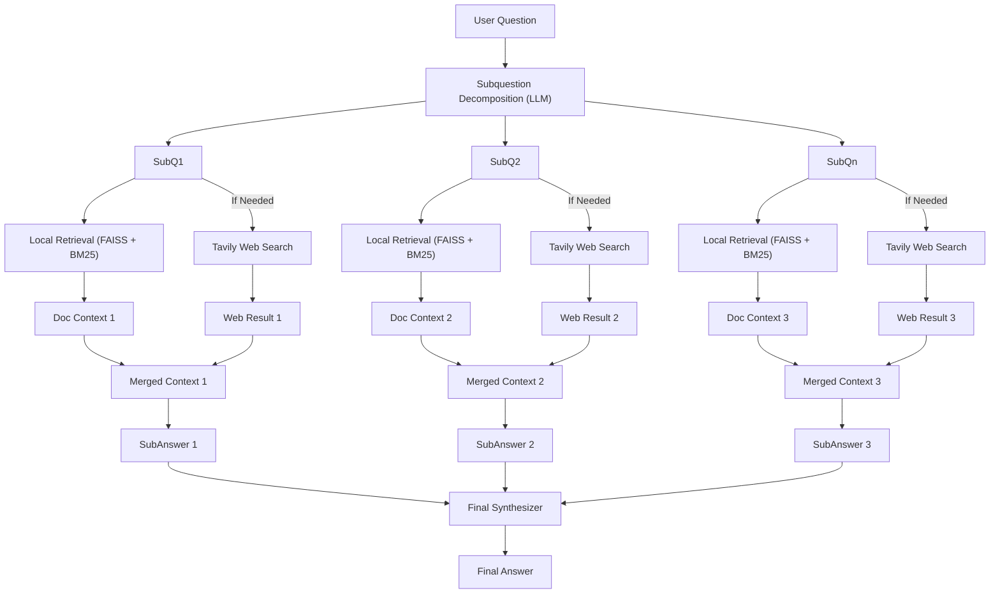

# 🔍 Multi-Hop Hybrid RAG with LangGraph + Tavily + Claude (Agentic QA System)

This project implements an **Agentic Multi-Hop RAG (Retrieval-Augmented Generation)** system using:

- 🧠 **LangGraph** for multi-agent orchestration
- 📄 **Hybrid Retrieval** via FAISS (Ollama embeddings) + BM25
- 🌐 **Tavily Web Search** (conditionally used)
- 🤖 **Claude 3.5 Haiku** (via Anthropic) as the main LLM or can use **GROQ Agents**
- 📚 **SemanticChunker** + PDF loader + Metadata tracking
- 🧪 **LangChain Expression Language** for modularity

---

## ⚙️ How it works




---

## 🧠 Key Features

- 🔗 **LangGraph Multi-Agent Loop**: Pro/Con/Validator style agents
- 📘 **PDF Upload + Semantic Chunking** for intelligent context
- 🔄 **Hybrid Retrieval**: FAISS for embeddings + BM25 for keyword match
- 🌐 **Optional Web Search** using Tavily only when needed
- 🧩 **Context Merging** for sub-question aggregation
- 🧵 **Subanswer Synthesis** for structured final output

---

## 🛠️ Tech Stack

- `LangChain`, `LangGraph`, `Anthropic`, `Tavily`
- `FAISS`, `BM25Retriever`, `OllamaEmbeddings`
- `PyMuPDFLoader`, `SemanticChunker`
- `Streamlit` for UI (optional)

---

## 🚀 Getting Started

1. Clone the repo  
   ```bash
   git clone https://github.com/yourname/hybrid-multihop-rag.git
   cd hybrid-multihop-rag
   ```

2. Install dependencies  
   ```bash
   pip install -r requirements.txt
   ```

3. Add your API keys:
   - `.env` file or directly in code
     ```
     ANTHROPIC_API_KEY=...
     TAVILY_API_KEY=...
     ```

4. Run the app:
   ```bash
   streamlit run app.py
   ```

---

## ✍️ Example Prompt

> **Q:** What are the recent climate policy changes in the EU, and how do they compare to US initiatives?

- 🔹 SubQs:
  - What are recent climate policy changes in the EU?
  - What are similar US climate policy updates?
  - How do the two compare?

Final synthesized answer is returned after merging relevant document + web search results.

---

## 🤖 Credits

Made with ❤️ by [Puneet Rawat] using LangGraph + Claude/Groq + Tavily + LangChain + FAISS magic.

